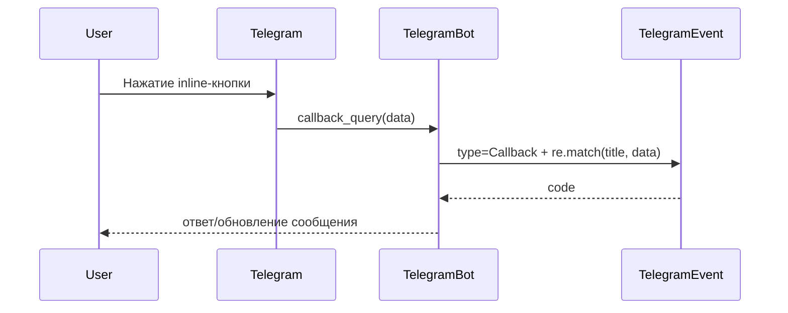

# TelegramBot - Inline-клавиатуры и `callback_query`

Inline-кнопки отправляют `callback_query`, а данные кнопки приходят в `callback.data`.

## Как это работает

1. Пользователь нажимает inline-кнопку.
2. Telegram отправляет `callback_query`.
3. Плагин ищет активные `TelegramEvent` с `type == Callback`.
4. Выполняет `re.match(event.title, callback.data)`.
5. При совпадении запускает `event.code` через `exec()`.



> [!IMPORTANT]
> Код callback выполняется на верхнем уровне через `exec()`, поэтому `return` использовать нельзя.

---

## Создание inline-клавиатуры

Используйте:

- `self.buildInlineKeyBoard(buttons)`

Где `buttons` - список строк, строка - словарь `{ "Текст": "callback_data" }`.

```python
buttons = [
    {"Статус": "menu:status"},
    {"Вкл": "menu:on", "Выкл": "menu:off"},
]
keyboard = self.buildInlineKeyBoard(buttons)
self.send_message(message.chat.id, "Выберите действие:", markup=keyboard)
```

---

## Создание callback-обработчика

1. Откройте `TelegramBot -> Events`.
2. Нажмите `Add event`.
3. Заполните:
   - `Type`: `Callback`
   - `Name (title)`: regex для `callback.data`
   - `Code`: Python-код

> [!TIP]
> Для точного совпадения используйте шаблоны с `^...$`.

---

## Рабочие примеры

### Одна кнопка

- `title`: `^menu:status$`

```python
self.bot.answer_callback_query(callback.id)
self.send_message(callback.message.chat.id, "<b>Статус</b>: OK")
```

### Несколько кнопок одним шаблоном

- `title`: `^menu:(.+)$`

```python
import re

self.bot.answer_callback_query(callback.id)
m = re.match(r"^menu:(.+)$", callback.data or "")
if m:
    action = m.group(1)
    if action == "on":
        self.send_message(callback.message.chat.id, "Включено")
    elif action == "off":
        self.send_message(callback.message.chat.id, "Выключено")
    else:
        self.send_message(callback.message.chat.id, f"Получено действие: {action}")
```

### Редактирование исходного сообщения

```python
self.bot.answer_callback_query(callback.id)
self.bot.edit_message_text(
    text="Статус обновлён",
    chat_id=callback.message.chat.id,
    message_id=callback.message.message_id,
)
```

---

## Доступные переменные

В `TelegramEvent.code` для callback доступны:

| Переменная | Назначение |
| --- | --- |
| `self` | Объект модуля `TelegramBot` |
| `callback` | Объект `CallbackQuery` |
| `logger` | Логгер |

Часто используемые поля:

- `callback.data`
- `callback.id`
- `callback.message.chat.id`

