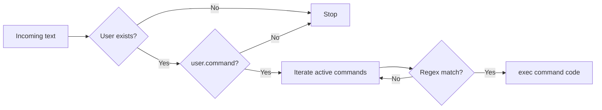

# TelegramBot - Команды и ответные сообщения

Команды в `TelegramBot` - это regex + Python-код, который выполняется при совпадении входящего текста.

## Как срабатывают команды

Алгоритм `MessageHandler`:

1. Проверка наличия пользователя в `TelegramUser`.
2. Проверка `TelegramUser.command`.
3. Поиск активных `TelegramCommand`.
4. Сопоставление `re.match(cmnd.title, message.text)`.
5. Выполнение `TelegramCommand.code`.



> [!WARNING]
> Если у пользователя выключен флаг `Command`, код команд не выполнится.

---

## Поля TelegramCommand

| Поле | Назначение | Важно |
| --- | --- | --- |
| `title` (Name) | Regex по `message.text` | Используйте корректные шаблоны Python regex |
| `description` | Описание для UI | На выполнение не влияет |
| `active` | Включение/выключение команды | `false` = команда игнорируется |
| `code` | Python-код обработчика | Выполняется через `exec()` |
| `priority` | Позиция в reply-клавиатуре | Меньше значение = выше |
| `show` | Показ в reply-клавиатуре | Работает вместе с `user.command` |
| `users` | Ограничение по chat id | Хранится строкой `id1,id2,...` |

> [!TIP]
> В `users` храните полные `chat_id` без сокращений.

---

## Переменные в коде команды

В `code` доступны:

- `self` - объект модуля `TelegramBot`
- `message` - объект входящего сообщения
- `logger` - логгер

Код запускается через `exec()` на верхнем уровне:

- `return` использовать нельзя (`SyntaxError: 'return' outside function`)
- для раннего выхода используйте `if/else`

```python
# корректно
if not message.text:
    self.send_message(message.chat.id, "Пустая команда")
else:
    self.send_message(message.chat.id, "OK")
```

> [!IMPORTANT]
> `print()` не отправляет ответ пользователю. Для ответа используйте `self.send_message(...)`.

---

## Рабочие примеры

### 1) Простая команда `/ping`

- `title`: `^/ping$`

```python
self.send_message(message.chat.id, "<b>PONG</b>")
```

### 2) Команда с аргументом `/say текст`

- `title`: `^/say\s+.+$`

```python
import re

text_in = (message.text or "").strip()
m = re.match(r"^/say\s+(.+)$", text_in)
if m:
    self.send_message(message.chat.id, f"Вы сказали: {m.group(1)}")
```

### 3) Поддержка групп `/say@YourBotName текст`

- `title`: `^/say(?:@\w+)?\s+.+$`

```python
import re

text_in = (message.text or "").strip()
m = re.match(r"^/say(?:@\w+)?\s+(.+)$", text_in)
if m:
    self.send_message(message.chat.id, f"Вы сказали: {m.group(1)}")
```

### 4) Inline-клавиатура из команды

```python
buttons = [
    {"Статус": "menu:status"},
    {"Включить": "menu:on"},
    {"Выключить": "menu:off"},
]
keyboard = self.buildInlineKeyBoard(buttons)
self.send_message(message.chat.id, "<b>Меню</b>:", markup=keyboard)
```

Дальнейшая обработка нажатий - в [`Callbacks.ru.md`](Callbacks.ru.md).

