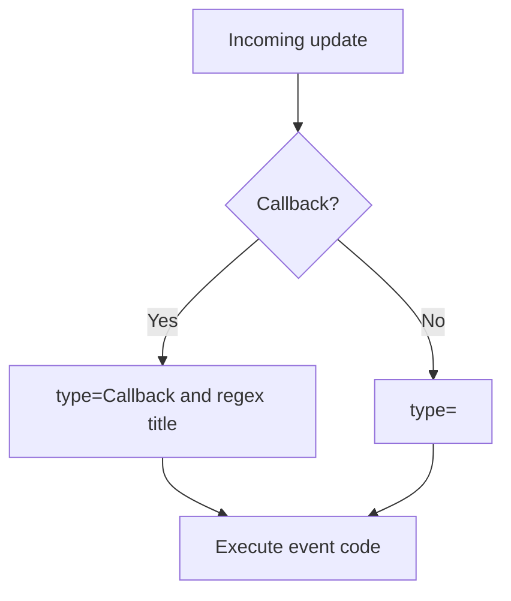

# TelegramBot - Какие типы сообщений перехватываются

Модуль работает с двумя независимыми механизмами: `TelegramCommand` и `TelegramEvent`.

## TelegramCommand

`TelegramCommand` применяется только к входящему тексту (`message.text`).

Проверки перед выполнением:

1. Пользователь существует (`TelegramUser`).
2. У пользователя включен `command`.
3. Есть совпадение `re.match(command.title, message.text)`.
4. Выполняется `command.code`.

> [!NOTE]
> Команды и события могут работать параллельно для одного и того же сообщения.

---

## TelegramEvent

`TelegramEvent` выбирается по типу (`TypeEvent`) и исполняет `event.code`.

Особенность:

- Для `Callback` дополнительно используется regex-фильтрация:
  - `re.match(event.title, callback.data)`
- Для остальных типов фильтр идет только по типу события.

---

## Таблица TypeEvent

| `TypeEvent` | Telegram content/update | Комментарий |
| --- | --- | --- |
| `Callback` | `callback_query` | Данные в `callback.data` |
| `Text` | `text` | Текст в `message.text` |
| `Image` | `photo` | Обычно берут `message.photo[-1]` |
| `Voice` | `voice` | OGG/Opus |
| `Audio` | `audio` | Музыкальные файлы |
| `Video` | `video` | Видео-сообщения |
| `Document` | `document` | Любые файлы |
| `Sticker` | `sticker` | Стикеры |
| `Location` | `location` | Геопозиция |
| `Venue` | `venue` | Локация + описание |
| `Contact` | `contact` | Контакт |
| `Dice` | `dice` | Игровой кубик |

---

## Переменные в коде событий

| Контекст | Доступные переменные |
| --- | --- |
| `Callback` | `self`, `callback`, `logger` |
| Остальные события | `self`, `message`, `logger` |

Примеры полезных полей:

- callback: `callback.data`, `callback.id`, `callback.message.chat.id`
- message: `message.chat.id`, `message.text`, `message.voice.file_id` и т.д.

> [!CAUTION]
> Код события выполняется через `exec()`; избегайте долгих блокирующих операций прямо в обработчике.
