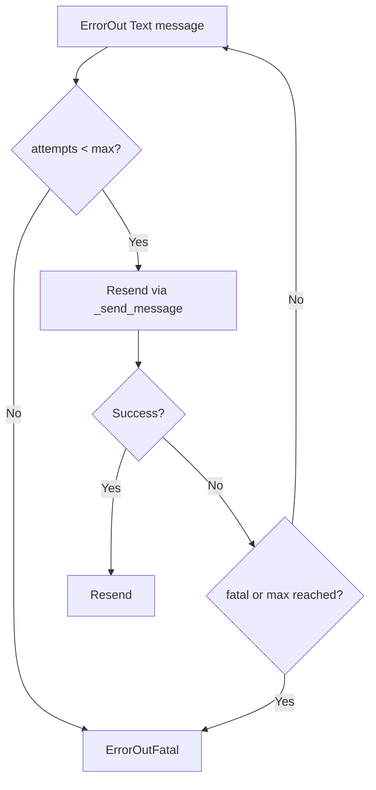

# TelegramBot - История и повторные отправки

Модуль хранит журнал событий в `TelegramHistory` и умеет повторять неуспешные исходящие текстовые сообщения.

## Что хранится в TelegramHistory

| Поле | Значение |
| --- | --- |
| `user_id` | Chat id пользователя (`callback.from_user.id` для callback) |
| `created` | Время события (UTC) |
| `direction` | Направление/статус (`TypeDirection`) |
| `type` | Тип события (`TypeEvent`) |
| `message` | Текст (`message.text` или `callback.data`) |
| `raw` | JSON события в строке |
| `send_attempts` | Количество попыток повторной отправки |

> [!NOTE]
> Во вкладке `History` обычно показываются последние 200 записей.

---

## Механизм resend

Повторная отправка выполняется циклически (примерно раз в 60 секунд).

Условия отбора:

- `direction` в диапазоне ошибок отправки;
- `send_attempts < MAX_SEND_ATTEMPTS`;
- `type == TypeEvent.Text`.

Алгоритм:

1. Увеличить `send_attempts`.
2. Отправить текст через `_send_message(...)`.
3. При успехе -> `direction = Resend`.
4. При ошибке:
   - если достигнут лимит попыток, или
   - если ошибка фатальная,
   - тогда `direction = ErrorOutFatal`.



`MAX_SEND_ATTEMPTS` задаётся в `plugins/TelegramBot/constants.py` (по умолчанию `5`).

---

## Очистка истории

В цикле также вызывается:

```python
TelegramHistory.clean_history_day(history_day)
```

Где `history_day` берется из `Settings -> History days`.

### Практический чек-лист

- [ ] Установить разумный `History days` (обычно 7-30).
- [ ] Периодически проверять записи `ErrorOutFatal`.
- [ ] Проверять корректность `chat_id` при массовых отправках.

